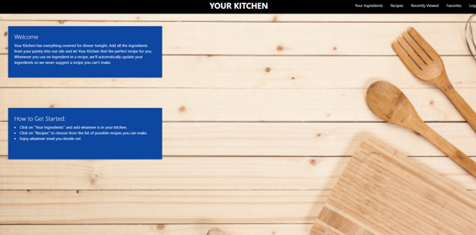

# Portfolio

## README created by: MrBusiness87

[Video LINK](#link to website video#)

---

# Table of Contents:

- [Title](#Title)
- [Description](#Description)
- [Links](#Links)
- [License](#License)
- [Questions](#Questions)

---

## Title:

Portfolio

## Description:

This is my new and revised portfolio. Created from scratch with no help of any CSS Framework. Hope you like it.

---

## Links:

|                                                                                           |                                                                                       |                                                                                          |     |
| ----------------------------------------------------------------------------------------- | ------------------------------------------------------------------------------------- | ---------------------------------------------------------------------------------------- | --- |
|  |  |  |
| Deployed Link: [LINKED IN!](https://www.linkedin.com/in/BorjanBartula)                    | Deployed Link: [QUIZ GAME](https://mrbusiness87.github.io/QUIZ-GAME/)                 | Deployed Link: [WEATHER APP](https://mrbusiness87.github.io/WEATHER_thumbnail.png)       |
|                                                                                           | Repository Link: [QUIZ GAME](https://github.com/MrBusiness87/QUIZ-GAME)               | Repository Link: [WEATHER APP](https://github.com/MrBusiness87/Weather-Forecaster)       |
|   |    |          |
| Deployed Link: [SCHEDULER APP](https://mrbusiness87.github.io/Work-Day-Scheduler/)        | Deployed Link: [SPORTS FINDER](https://mrbusiness87.github.io/Finder-Project1/)       | Deployed Link: [YOUR KITCHEN](https://your-kitchen.herokuapp.com/)                       |
| Repository Link: [SCHEDULER APP](https://github.com/MrBusiness87/Work-Day-Scheduler)      | Repository Link: [SPORTS FINDER](https://github.com/MrBusiness87/Finder-Project1)     | Repository Link: [YOUR KITCHEN](https://github.com/MrBusiness87/Your_Kitchen)            |

 
Click <a href="./assets/RESUME Coding.pdf" download>HERE</a> to Download My RESUME

## License:

License None:  When there is no license there is no copyright, except the one you create yourself.

## Additional Notes:

Each project has a description in it's repository link for what was done on the project and which technologies are used.

---

## Questions:

- GitHub Page: https://github.com/MrBusiness87
- Please send an email to: bbartula87@gmail.com, with any Questions/Concerns/Comments!
